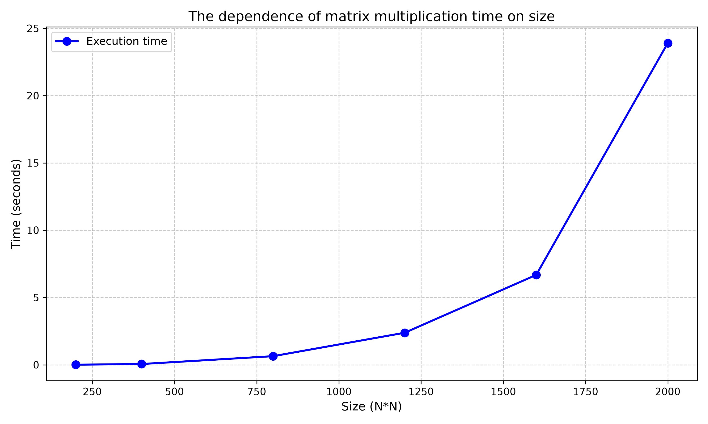

# Лабораторная работа №1: Перемножение квадратных матриц

## 1. Постановка задачи

**Цель работы:** реализовать алгоритм перемножения двух квадратных матриц на языке C++ и провести анализ его временной сложности.

**Исходные данные:** файлы с квадратными матрицами A и B.  
**Выходные данные:** файл с результатом умножения (матрица C), время выполнения.

## 2. Реализация

Алгоритм реализован на C++ с использованием классического тройного цикла (без сторонних библиотек для умножения).  
Замер времени производится с помощью библиотеки `<chrono>`.

**Фрагмент кода (умножение):**
```cpp
for (int i = 0; i < _size; ++i)
    for (int j = 0; j < _size; ++j) {
        int s = 0;
        for (int k = 0; k < _size; ++k)
            s += (*this)[i][k] * other[k][j];
        prod[i][j] = s;
    }
```
Сложность алгоритма: O(N³), где N — размер матрицы.
Для генерации файла с матрицами был написан скрипт на Python (generate.py)

## 3. Верификация и результаты вычислений

Для проверки корректности вычислений был написан скрипт на Python (verify.py), использующий библиотеку numpy.
Скрипт считывает исходные матрицы и результат работы C++ программы, после чего сравнивает результат с эталонным вычислением через np.dot().

| Размер матрицы (N) | Время выполнения (сек) |
| :---: | :---: |
| 200 | 0.0057 |
| 400 | 0.0550 |
| 800 | 0.6390 |
| 1200 | 2.3790 |
| 1600 | 6.6766 |
| 2000 | 23.9094 |

## 4. График зависимости времени от размера



## 5. Выводы

1. **Программа работает правильно** — верификация с NumPy не показала ошибки

2. **Время выполнения растёт кубически** — при увеличении размера матрицы в 2 раза время выполнения увеличивается примерно в 8 раз. Например, при переходе с N=800 на N=1600 время выросло с 0.639 сек до 6.677 сек, то есть в ~10.4 раза, что близко к теоретическому значению 8. Это подтверждает теоретическую сложность алгоритма **O(N³)**.

3. **Размер матрицы сильно влияет на производительность** — на маленьких матрицах (200×200) время составляет тысячные доли секунды, тогда как на матрице 2000×2000 оно достигает почти 24 секунд. Это связано с тем, что количество операций умножения растёт как N³.

4. **Последовательная версия имеет ограничения** — для матриц размера 2000×2000 и выше время вычисления становится значительным, что делает актуальным переход к параллельным вычислениям (например, с использованием OpenMP), что будет рассмотрено в следующей лабораторной работе.
